# ICS 4104 Distributed Systems Project 2026

Group Members:

168377 - Kihumba Kevin Renana

166456 - Aira Samson Ologi

167141 - Karogo Joe


This project implements a customizable load balancer with consistent hashing, Docker-managed server replicas, and scripts for endpoint and load tests.

## Components

- `server/`: Flask web server exposing `/home` and `/heartbeat` on port `5000`.
- `load_balancer/`: Flask load balancer exposing `/rep`, `/add`, `/rm`, and request routing endpoints.
- `load_balancer/consistent_hash.py`: Consistent hash map with `M=512`, `K=log2(512)=9`, `H(i)=i^2+2i+17`, and `Phi(i,j)=i^2+j^2+2j+25`.
- `docker-compose.yml`: Runs the privileged load balancer and lets it spawn/remove server containers through the Docker socket.
- `scripts/`: Simple endpoint and asynchronous load-test helpers.

## Requirements

- Ubuntu 20.04 or later
- Docker 20.10.23 or later
- Docker Compose v2
- Python 3 for local test scripts


## Running

```bash
make up
```

The load balancer is exposed on `http://localhost:5000`.

Check current replicas:

```bash
curl http://localhost:5000/rep
```

Route a request through the load balancer:

```bash
curl http://localhost:5000/home
```

Scale up:

```bash
curl -X POST http://localhost:5000/add \
  -H "Content-Type: application/json" \
  -d '{"n": 2, "hostnames": ["S5", "S4"]}'
```

Scale down:

```bash
curl -X DELETE http://localhost:5000/rm \
  -H "Content-Type: application/json" \
  -d '{"n": 1, "hostnames": ["S5"]}'
```

Stop the system:

```bash
make down
```


## Design Choices

The server is intentionally minimal because the assignment focuses on load balancing. Each server returns its `SERVER_ID` so request distribution can be measured from `/home` responses.

The load balancer maintains a consistent hash ring with virtual server entries. Server slots use linear probing to resolve conflicts. Client requests use random six-digit request IDs and are mapped clockwise to the nearest virtual server slot. Replica hostnames remain human-readable, while numeric six-digit server IDs are chosen to reduce ring imbalance under the assignment hash function.

The load balancer runs as a privileged container with `/var/run/docker.sock` mounted. This allows it to start and remove server containers dynamically on the shared Docker network. A background heartbeat loop checks `/heartbeat`; when a replica fails, it is removed from the ring and replaced until the default replica count is restored.

## Testing

Endpoint smoke tests:

```bash
make test-endpoints
```

Run 10000 asynchronous requests:

```bash
make test-load
```

## Task 4: Analysis

### A-1: 10000 Requests, N=3

Run:

```bash
make up
python scripts/async_requests.py --requests 10000 --url http://localhost:5000/home
```
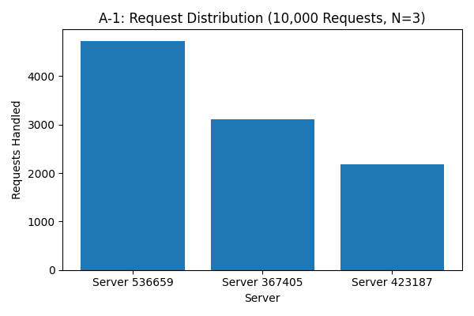

Observation: 
A total of 10,000 asynchronous requests were sent through the load balancer while maintaining three active server replicas. The requests were distributed as follows:

Server 536659: 4,725 requests (47.25%)

Server 367405: 3,102 requests (31.02%)

Server 423187: 2,173 requests (21.73%)

Perfomance Analysis: 
The load balancer successfully routed all 10,000 requests to the available server replicas without failures. However, the request distribution is noticeably uneven, with one server handling almost half of all requests. This suggests that although the consistent hashing implementation is functioning correctly, the current placement of virtual servers on the hash ring results in an imbalance. Increasing the number of virtual servers or using a different hash function may improve load distribution.


### A-2: Scalability Analysis

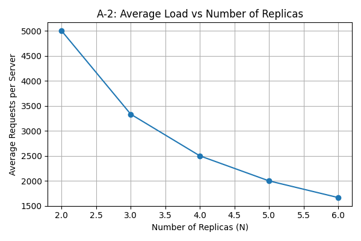


Observation:
The experiment was repeated with the number of replicas increased from 2 to 6 while maintaining a constant workload of 10,000 asynchronous requests. As more replicas were added, the average number of requests handled by each server decreased from 5,000 requests at two replicas to approximately 1,667 requests at six replicas.

View on Scalability:
The results demonstrate that the load balancer scales effectively as additional server replicas are introduced. Although the request distribution among individual servers is not perfectly uniform due to the consistent hashing algorithm and virtual server placement, the overall workload is shared across a larger number of servers. Consequently, the average load per server decreases approximately in inverse proportion to the number of replicas, indicating good horizontal scalability.

### A-3: Failure Recovery

Endpoint Testing

The following endpoints were successfully tested:

Endpoint	Result
GET /rep	Successfully returned the current number of replicas and their hostnames.

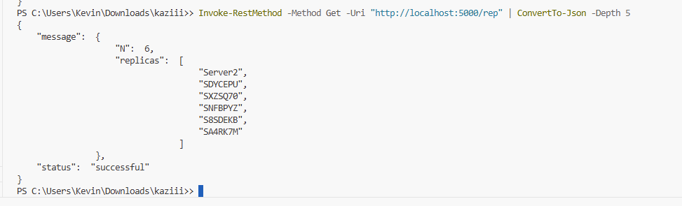


GET /home	Successfully routed requests to active server replicas.

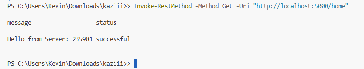


POST /add	Successfully increased the number of server replicas.

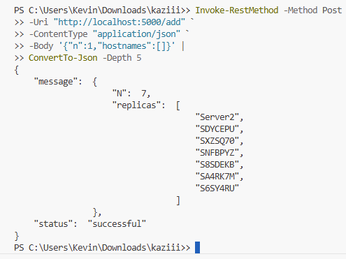


DELETE /rm	Successfully removed the requested number of replicas.

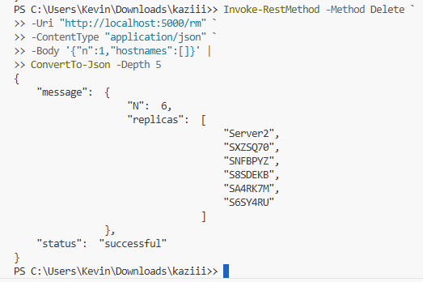

## Failure Recovery

Before Failure

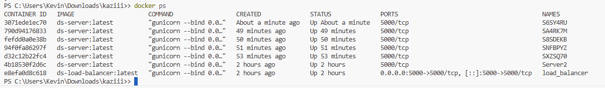


After Removing One Server


Recovery

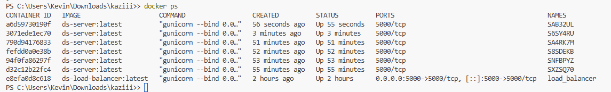

Observation

One server container was intentionally terminated using Docker. The heartbeat mechanism running inside the load balancer detected the missing server within a few seconds and automatically created a replacement container with a new hostname. Throughout the experiment, the desired number of replicas was maintained, demonstrating successful fault tolerance and automatic recovery.


### A-4: Modified Hash Functions

## Analysis of the Modified Hash Functions
## A-1 (N = 3)
Original Hash Functions
Server	Requests
Server 1	4725
Server 2	3102
Server 3	2173

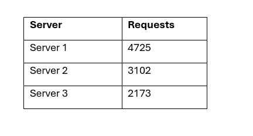


Distribution:
47.25%
31.02%
21.73%

Modified Hash Functions

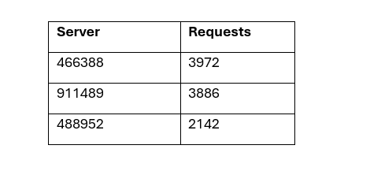

Distribution:
39.72%
38.86%
21.42%

Observation:
The modified hash functions produced a more balanced distribution between the first two servers compared to the original implementation. While one server still handled fewer requests, the difference between the two busiest servers decreased, indicating that the modified hash functions altered the placement of requests on the hash ring and improved load sharing.

## A-2 (Modified)

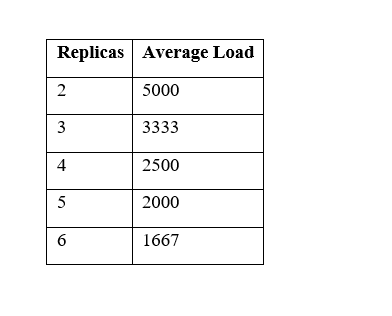

Just like before, the averages are exactly what we'd expect because the total workload remains fixed at 10,000 requests.

However, the individual distributions improved.

For example:

Original (N = 4)
3816
2535
2219
1430

Very uneven.

Modified (N = 4)
2870
2791
2189
2150

Much closer together.

## Comparison Table for README

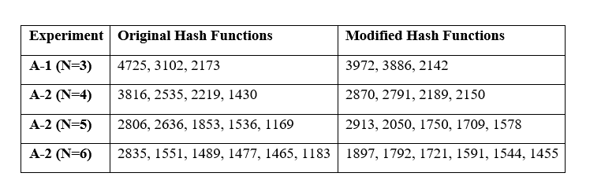


## A-4: Modified Hash Functions
Modified Hash Functions

```python
def default_request_hash(request_id: int) -> int:
    return request_id * request_id + 5 * request_id + 31

def default_server_hash(server_id: int, virtual_id: int) -> int:
    return (
        server_id * server_id
        + 3 * virtual_id * virtual_id
        + 7 * virtual_id
        + 19
    )
```

The original assignment hash functions were replaced with alternative quadratic hash functions to evaluate how different hash functions affect request distribution and load-balancing performance.

Observation:
The original hash functions were replaced with alternative quadratic hash functions to investigate their effect on load balancing. The modified functions changed the placement of both requests and virtual server nodes on the hash ring. As a result, the distribution of requests became more balanced in several experiments, particularly when using three and four server replicas.

Analysis:
The experiments demonstrate that the choice of hash function significantly influences the effectiveness of consistent hashing. Better-distributed hash values reduce clustering and improve the balance of requests across replicas. Although both implementations maintained scalability as the number of replicas increased, the modified hash functions produced a more uniform distribution of requests and therefore improved the overall load-balancing performance.


## Conclusion
This project successfully implemented a customizable load balancer using consistent hashing and Docker-managed server replicas. The load balancer supported dynamic scaling, automatic failure recovery, and distributed incoming requests across multiple server replicas. Experimental results demonstrated that increasing the number of replicas reduced the average workload per server, confirming the scalability of the implementation. Modifying the hash functions also showed that the choice of hashing algorithm directly influences request distribution and overall load-balancing performance.